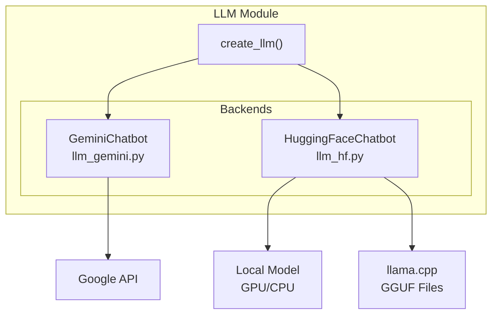
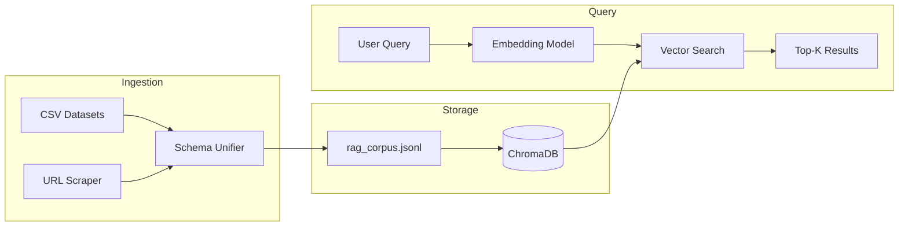

# System Design & Implementation

This document describes the design and implementation of the core Iteration 2 modules: LLM integration, RAG pipeline, and price prediction.

## LLM/Policy Module

### Architecture Overview



The LLM module provides a unified interface supporting:

1. **Gemini Flash**: Google's Gemini 2.0 Flash model via `google-generativeai` SDK
2. **HuggingFace Transformers**: Local models with 4-bit/8-bit quantization
3. **llama.cpp**: GGUF models for CPU-efficient inference

Backend selection is controlled via environment variables with automatic detection based on model file extensions.

### System Prompts

The LLM is configured with domain-specific prompts that enforce the real estate agent persona:

- Understand client needs (budget, location, property type)
- Suggest suitable properties from the RAG knowledge base
- Provide accurate price information
- Maintain a polite, professional tone suitable for voice conversation
- Keep responses concise for natural dialogue flow

### Streaming Response Generation

The dialogue API uses NDJSON streaming for real-time token delivery:

```json
{"type": "token", "content": "Ji"}
{"type": "token", "content": " bilkul"}
{"type": "action", "data": {"type": "show_listings", "payload": {...}}}
```

---

## RAG Pipeline

### Architecture Overview



### Data Ingestion

1. **Dataset Loading**: CSV files from Kaggle loaded from `data/rag/`
2. **Schema Unification**: Maps diverse column names to unified schema
3. **URL Scraping** (Optional): Fetches descriptions from Zameen.com
4. **JSONL Export**: Outputs to `data/processed/rag_corpus.jsonl`

### Vector Store Configuration

| Parameter | Value |
|-----------|-------|
| Embedding Model | `paraphrase-multilingual-MiniLM-L12-v2` |
| Dimensions | 384 |
| Distance Metric | Cosine Similarity |
| Persist Directory | `data/vector/chroma` |
| Collection Name | `properties` |
| Batch Size | 512 documents |

### Query Interface

```python
def query(
    query_text: str,
    top_k: int = 5,
    filters: Optional[Dict[str, Any]] = None,
) -> List[Dict[str, Any]]:
    col = get_collection()
    where = {}
    if filters:
        if city := filters.get("city"):
            where["city"] = city
        if min_price := filters.get("min_price"):
            where["price"] = {"$gte": float(min_price)}
    
    res = col.query(
        query_texts=[query_text],
        n_results=top_k,
        where=where or None,
    )
    return res
```

---

## Price Prediction Agent

### Area Unit Normalization

A critical challenge in Pakistani real estate is the variance in "Marla" measurement:

| Context | Marla Size | Example Locations |
|---------|------------|-------------------|
| DHA/Bahria Societies | 225 sq ft | DHA Lahore, Bahria Town |
| Punjab Revenue | 272.25 sq ft | General Punjab areas |

The system automatically detects location context and applies the appropriate conversion factor.

### ML Pipeline

The price prediction system supports loading a trained scikit-learn model from `models/price_predictor.pkl`. Fallback heuristic:

```
Price = max(2,500,000, Area_sqft × 12,000)
```

---

## Dialogue Manager API

### Endpoints

| Endpoint | Method | Description |
|----------|--------|-------------|
| `/dialogue/step` | POST | Process dialogue turn with LLM + RAG (streaming) |
| `/rag/query` | POST | Semantic search over property listings |
| `/valuation/predict` | POST | Price range estimation |

### Intent Detection

```python
def _detect_intent(text: str) -> str:
    text_lower = text.lower()
    if any(k in text_lower for k in ["price", "qeemat", "kitne", "cost"]):
        return "price_query"
    elif any(k in text_lower for k in ["property", "ghar", "plot", "flat"]):
        return "property_search"
    elif any(k in text_lower for k in ["book", "visit", "dekhna"]):
        return "booking"
    return "general"
```

### Action Dispatch

| Action Type | Trigger | UI Widget |
|-------------|---------|-----------|
| `show_price` | Price query detected | Price estimation card |
| `show_listings` | Property search with results | Property cards grid |
| `book_visit` | Booking intent | Appointment form |
