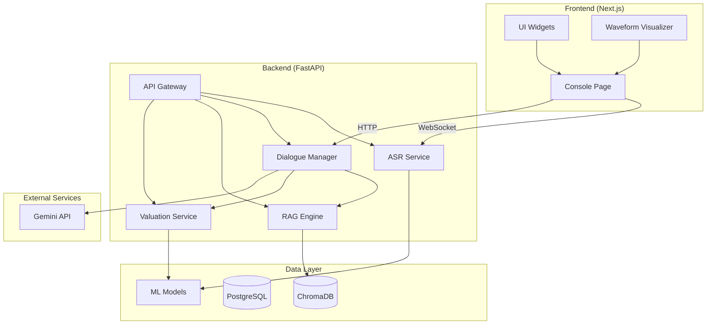
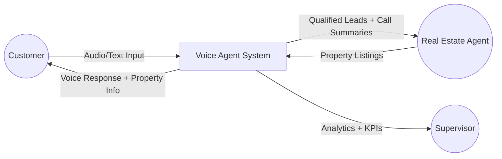
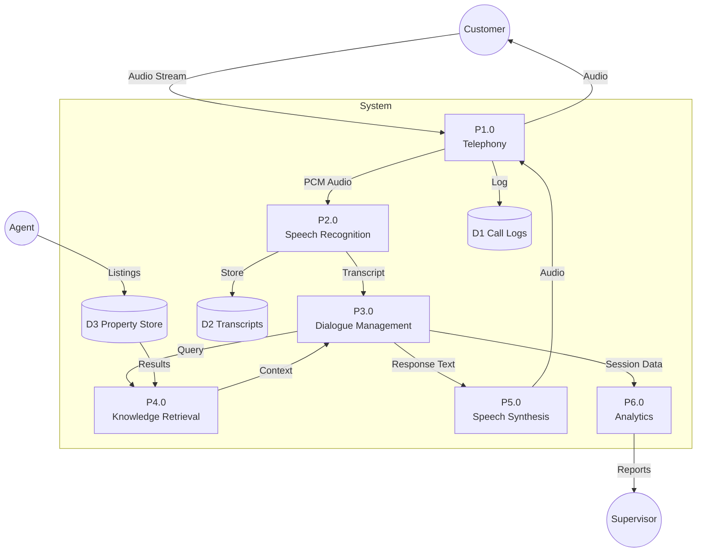
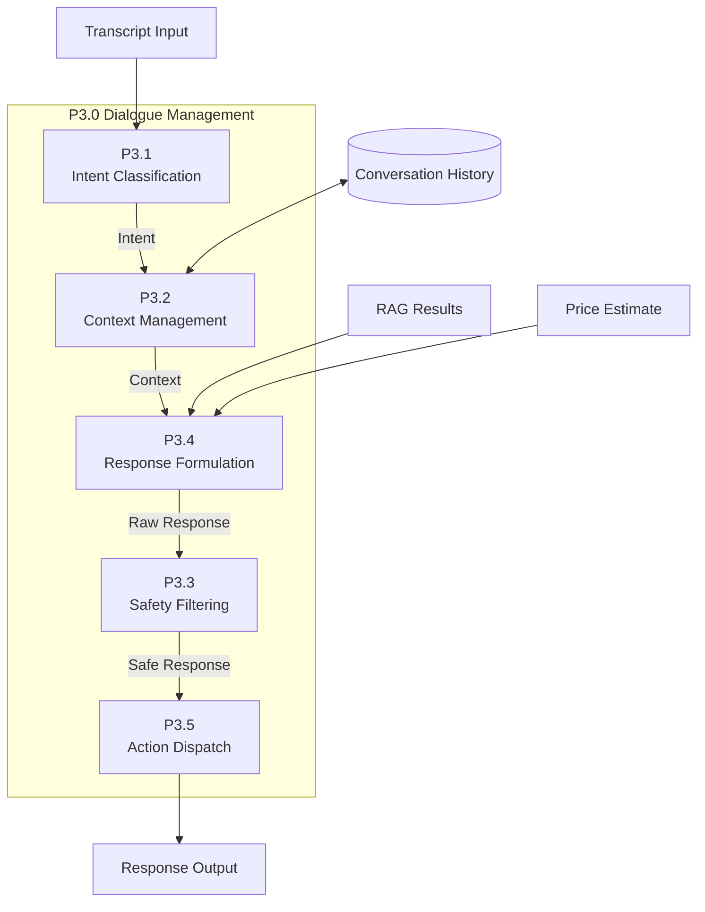
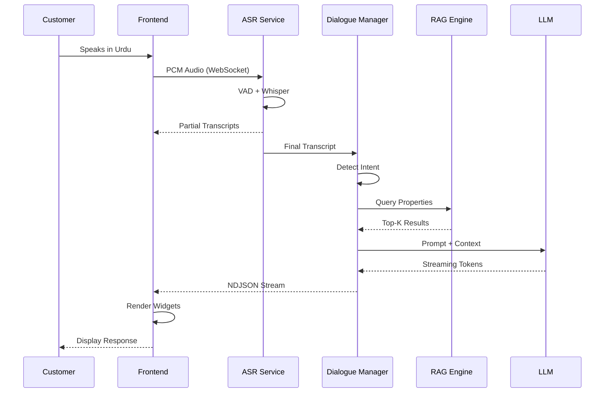
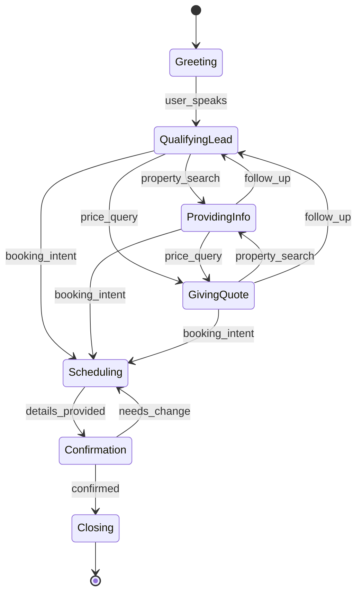

# System Architecture

This document presents the system architecture through various diagrams.

## High-Level Architecture

The system consists of three main layers:

- **Frontend (Next.js)**: Console page for agent interaction, UI widgets for displaying prices and listings, and waveform visualizer for audio feedback
- **Backend (FastAPI)**: API gateway routing to core services including ASR, Dialogue Manager, RAG Engine, and Valuation services
- **Data Layer**: ChromaDB for vector storage, PostgreSQL for structured data, and ML models for ASR and price prediction

---

## Data Flow Diagram - Level 0 (Context)

Three external entities interact with the system:

- **Customer**: Sends audio/text input and receives voice responses with property information
- **Real Estate Agent**: Provides property listings and receives qualified leads with call summaries
- **Supervisor**: Receives analytics and KPIs for performance monitoring

---

## Data Flow Diagram - Level 1

The Level 1 DFD reveals six major processes:

1. **P1.0 Telephony Processing**: Handles audio stream capture and playback
2. **P2.0 Speech Recognition**: Converts audio to text transcripts using Whisper ASR
3. **P3.0 Dialogue Management**: Processes transcripts, manages context, and generates responses
4. **P4.0 Knowledge Retrieval**: Searches the property vector store for relevant listings
5. **P5.0 Speech Synthesis**: Converts response text to audio (Iteration 3)
6. **P6.0 Analytics Processing**: Generates reports and KPIs for supervisors

---

## DFD Level 2 - Dialogue Management

The dialogue management process comprises five sub-processes:

1. **P3.1 Intent Classification**: Determines user intent (price query, property search, booking)
2. **P3.2 Context Management**: Maintains conversation history and session state
3. **P3.3 Safety Filtering**: Ensures responses are appropriate and accurate
4. **P3.4 Response Formulation**: Constructs prompts and generates LLM responses
5. **P3.5 Action Dispatch**: Routes responses and triggers appropriate UI widgets

---

## Sequence Diagram - Dialogue Turn

The sequence of events in a typical dialogue turn:

1. Customer speaks in Urdu
2. Frontend captures PCM audio and sends via WebSocket
3. ASR Service applies VAD and Whisper transcription
4. Partial transcripts are streamed back to frontend
5. Final transcript is sent to Dialogue Manager
6. Dialogue Manager detects intent and queries RAG Engine
7. RAG Engine returns top-K property results
8. Dialogue Manager constructs prompt with context and sends to LLM
9. LLM streams tokens back through the Dialogue Manager
10. Frontend displays tokens progressively and renders action widgets

---

## State Diagram - Dialogue States

Main dialogue states:

- **Greeting**: Initial state when session starts
- **QualifyingLead**: Main conversation state for understanding customer needs
- **ProvidingInfo**: Sharing property details based on search results
- **GivingQuote**: Presenting price estimates
- **Scheduling**: Booking property visits or appointments
- **Confirmation**: Confirming appointment details
- **Closing**: End of conversation
