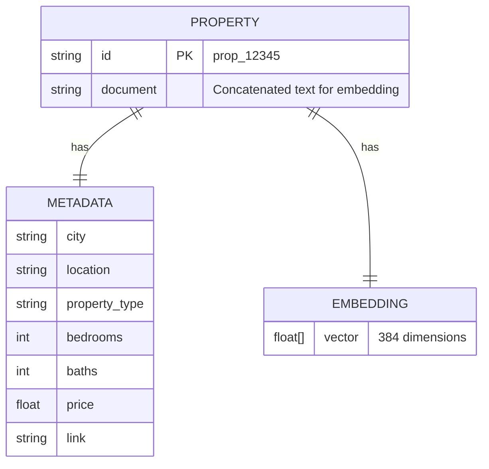
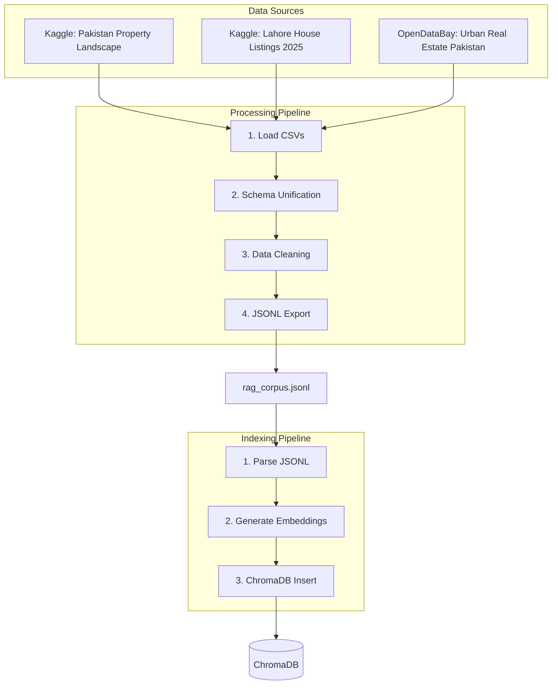

# Data Design

This document describes the data structures and schemas used in the RAG pipeline and vector store.

## RAG Corpus Schema

The processed property corpus uses a unified JSONL format optimized for semantic retrieval.

| Field | Type | Description |
|-------|------|-------------|
| `Property_Id` | string | Unique identifier |
| `City` | string | City name (Lahore, Islamabad, Karachi) |
| `Location` | string | Locality/sector name |
| `Long Location` | string | Full address |
| `Property Type` | string | House, Plot, Flat, Commercial |
| `Price` | float | Listed price in PKR |
| `Price in words` | string | Localized price (e.g., "3 Crore 50 Lakh") |
| `Bedrooms` | int | Number of bedrooms |
| `Baths` | int | Number of bathrooms |
| `Area (Marla)` | float | Area in Marla units |
| `Short Desc` | string | Title/headline |
| `Long Desc` | string | Full description (used for embeddings) |
| `Link` | string | Source URL |

## ChromaDB Collection Structure

Each document consists of:

- **id**: Unique property identifier (e.g., `prop_12345`)
- **document**: Concatenated text combining title, location, and description for embedding generation
- **metadata**: Structured fields for filtering (city, location, property_type, bedrooms, baths, price, link)

The collection uses **HNSW** (Hierarchical Navigable Small World) indexing for efficient approximate nearest neighbor search with cosine distance metric.

## Embedding Model Specifications

| Property | Value |
|----------|-------|
| Model | `paraphrase-multilingual-MiniLM-L12-v2` |
| Dimensions | 384 |
| Languages Supported | 50+ including Urdu, English, Hindi |
| Max Sequence Length | 128 tokens |
| Architecture | Transformer (DistilBERT-based) |
| License | Apache 2.0 |

**Model Selection Rationale:** The paraphrase-multilingual-MiniLM model was selected for its excellent multilingual support, which is crucial for handling the Urdu-English code-switching common in Pakistani real estate descriptions.

## Data Pipeline Flow

**Processing Pipeline:**

1. **Load CSVs**: Import raw data from multiple sources
2. **Schema Unification**: Map diverse column names to unified schema
3. **Data Cleaning**: Handle missing values, normalize price formats
4. **JSONL Export**: Output to `rag_corpus.jsonl`

**Indexing Pipeline:**

1. **Parse JSONL**: Read processed corpus line by line
2. **Generate Embeddings**: Use SentenceTransformer model in batches
3. **ChromaDB Insert**: Store documents with metadata

The ingestion process handles approximately **15,000 property listings** from combined datasets, with indexing completed in under 5 minutes on a standard CPU.
