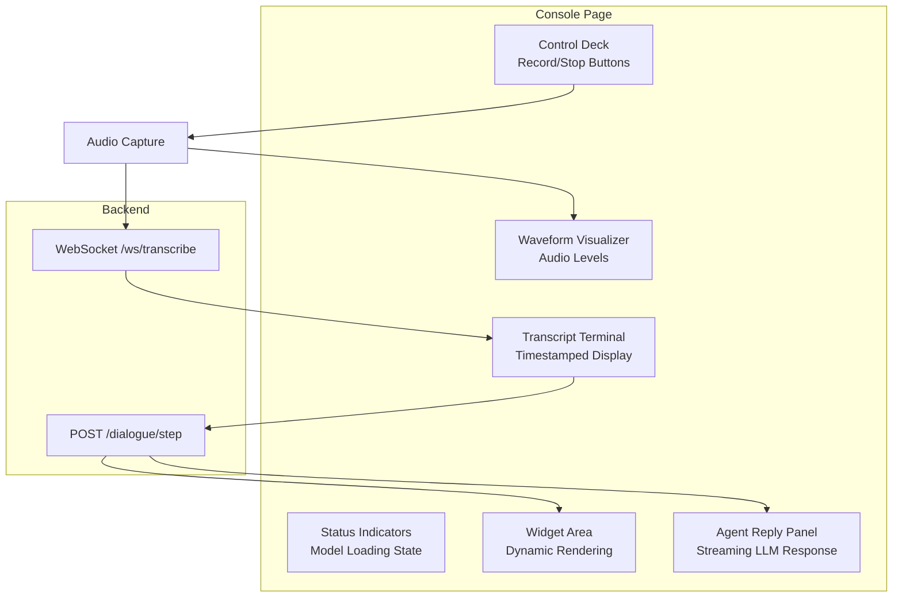
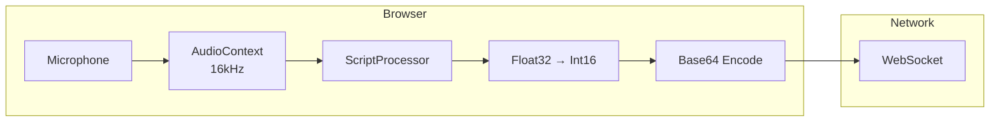
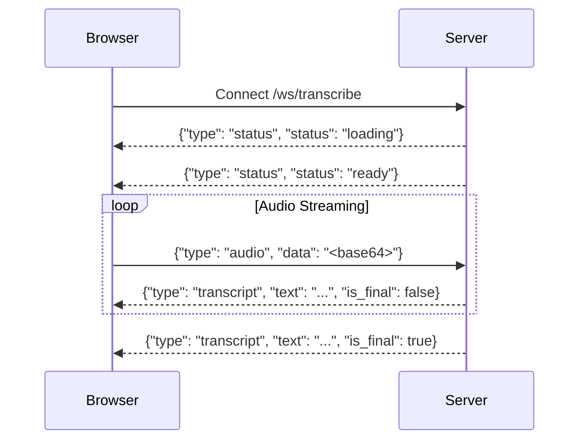

# Frontend Implementation

This document describes the frontend implementation, focusing on architectural decisions.

## Console UI Architecture

The Next.js console (`frontend/app/console/page.tsx`) provides a real-time interface for voice agent interaction.

**Key Components:**

| Component | Description |
|-----------|-------------|
| Control Deck | Record/stop buttons with keyboard shortcuts |
| Status Indicators | Real-time ASR model loading and readiness state |
| Waveform Visualizer | Audio level visualization using Web Audio API's AnalyserNode |
| Transcript Terminal | Timestamped display of partial and final transcriptions |
| Widget Area | Dynamic rendering of price estimates and property listings |
| Agent Reply Panel | Streaming display of LLM-generated responses |

## Audio Streaming Architecture

The frontend uses Web Audio API for raw PCM streaming instead of MediaRecorder:

- **Lower Latency**: Direct access to audio samples without codec overhead
- **Fixed Sample Rate**: Consistent 16kHz sampling required by Whisper ASR
- **Real-time Processing**: ScriptProcessor nodes enable per-buffer operations

The audio pipeline converts Float32 samples to Int16 PCM format, base64 encodes the buffer, and transmits via WebSocket in 4096-sample chunks (256ms at 16kHz).

## Widget System

The UI implements dynamic widgets triggered by action payloads from the dialogue API:

| Component | File | Purpose |
|-----------|------|---------|
| PriceWidget | `PriceWidget.tsx` | Display price range with confidence indicator |
| RagWidget | `RagWidget.tsx` | Grid of property listing cards with key details |
| WaveformVisualizer | `WaveformVisualizer.tsx` | Real-time audio waveform using canvas |

Each widget is designed for voice-first interaction:

- High-contrast colors for quick visual scanning
- Large typography for readability
- Minimal interaction requirements (information display focused)
- Smooth animations for state transitions

## WebSocket Communication

The frontend maintains a persistent WebSocket connection for:

- **Audio Upload**: Streaming PCM audio chunks for ASR processing
- **Transcript Events**: Receiving partial and final transcriptions
- **Status Updates**: Model loading states and error notifications

A separate HTTP endpoint handles dialogue API calls with NDJSON streaming for token-by-token response display.
