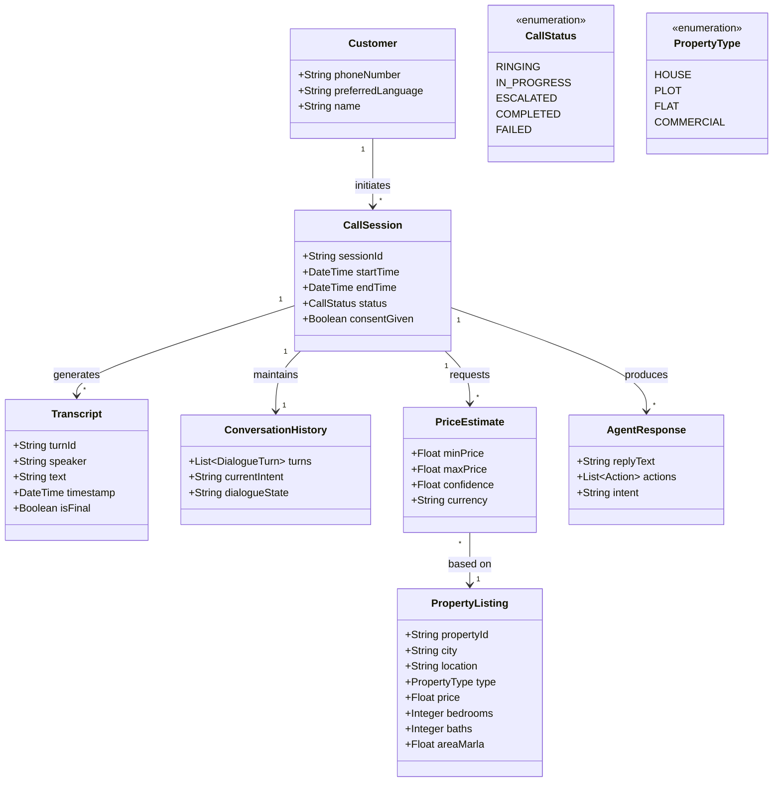

# Project Requirements

This document describes the functional and non-functional requirements, including key use cases and the domain model.

## Use Cases

### Use Case: Inbound Property Inquiry Call

| Attribute | Description |
|-----------|-------------|
| Scope | Urdu-Native Voice Agent — Inbound Call Processing |
| Level | User-Goal |
| Primary Actor | Potential Customer |
| Preconditions | Telephony gateway operational, ASR/TTS models loaded, Property database indexed |
| Postconditions | Customer query resolved or escalated, Call logged and summarized |

**Main Success Scenario:**

1. Customer calls the advertised number
2. System answers, plays greeting, and requests consent for recording
3. Customer speaks inquiry in Urdu (e.g., "Lahore mein 10 marla plot ki price kya hai?")
4. ASR transcribes speech to text in real-time
5. Dialogue Manager extracts intent and key entities (location, type, size)
6. RAG agent retrieves relevant listings; price-prediction provides estimate
7. LLM formulates a natural Urdu response
8. TTS converts response to speech and plays to user
9. Conversation continues until query is resolved
10. System logs redacted transcript and generates summary

---

### Use Case: Outbound Lead Qualification Call

| Attribute | Description |
|-----------|-------------|
| Scope | Urdu-Native Voice Agent — Outbound Campaign |
| Level | User-Goal |
| Primary Actor | System Agent |
| Preconditions | Lead list loaded, Telephony operational, Calling hours appropriate |
| Postconditions | Lead qualified/disqualified, Call result logged, Follow-up scheduled |

**Main Success Scenario:**

1. System initiates outbound call to lead
2. System identifies itself as AI agent and requests consent
3. Customer engages in conversation
4. ASR transcribes customer responses
5. Dialogue Manager qualifies lead based on budget, timeline, and preferences
6. System provides relevant property suggestions
7. System attempts to schedule follow-up or viewing
8. Conversation results logged in CRM; lead status updated

---

### Use Case: Property Price Estimation Request

| Attribute | Description |
|-----------|-------------|
| Scope | Urdu-Native Voice Agent — Price Estimation |
| Level | User-Goal |
| Primary Actor | Customer |
| Preconditions | Property database contains comparable listings, Price prediction model operational |
| Postconditions | Price estimate provided with confidence level, Comparable properties cited |

**Main Success Scenario:**

1. Customer describes property features
2. ASR transcribes property description
3. Dialogue Manager extracts property attributes
4. RAG engine finds comparable properties
5. Price prediction model calculates estimate range
6. System provides estimate with confidence level
7. System cites comparable properties used for estimation
8. Customer may ask follow-up questions for additional context

---

## Functional Requirements

### Module 1: Automatic Speech Recognition (ASR)

- **FR-1.1**: Transcribe spoken Urdu from narrowband telephony audio with WER <20%
- **FR-1.2**: Support real-time streaming transcription with partial results
- **FR-1.3**: Normalize and transcribe Roman Urdu input into standardized text
- **FR-1.4**: Implement lexicon biasing for at least 500 domain-specific terms
- **FR-1.5**: Provide per-token confidence scores for transcription assessment

### Module 2: Dialogue Manager & LLM Policy

- **FR-2.1**: Use a locally hosted LLM to generate contextually appropriate Urdu responses
- **FR-2.2**: Classify user intent with >90% accuracy
- **FR-2.3**: Integrate with RAG module to incorporate retrieved facts into responses
- **FR-2.4**: Enforce safety policies, preventing unverified information sharing
- **FR-2.5**: Maintain conversation context across multiple dialogue turns

### Module 3: RAG & Price-Prediction Agent

- **FR-3.1**: Retrieve top-3 most relevant property listings from vector database
- **FR-3.2**: Provide price range estimate citing features used for prediction
- **FR-3.3**: Achieve MAPE <15% on held-out test set
- **FR-3.4**: Track provenance for all factual statements and estimates
- **FR-3.5**: Update property database with new listings and price changes

### Module 4: Text-to-Speech (TTS)

- **FR-4.1**: Synthesize Urdu speech with Mean Opinion Score (MOS) >3.5
- **FR-4.2**: Begin audio playback as soon as partial audio is ready
- **FR-4.3**: Support SSML-style markup for pauses and emphasis
- **FR-4.4**: Handle Urdu text normalization and proper pronunciation

### Module 5: Telephony & Voice Gateway

- **FR-5.1**: Connect to SIP trunk to place and receive telephone calls
- **FR-5.2**: Play consent message at call start and only record if consent given
- **FR-5.3**: Manage multiple concurrent call sessions
- **FR-5.4**: Handle call transfer and escalation to human agents

### Module 6: Analytics Dashboard

- **FR-6.1**: Automatically redact PII from call transcripts with >95% recall
- **FR-6.2**: Display key metrics: call volume, handling time, conversion rate
- **FR-6.3**: Generate automated call summaries with key conversation points
- **FR-6.4**: Provide role-based access control for different user types

---

## Non-Functional Requirements

### Performance

- **PER-1**: Process audio streams with latency suitable for real-time conversation
- **PER-2**: Handle multiple concurrent sessions without degradation
- **PER-3**: Complete database queries within acceptable time limits
- **PER-4**: Load and process models efficiently within hardware constraints

### Reliability

- **REL-1**: Achieve high availability during operational hours
- **REL-2**: Have robust error handling and recovery mechanisms
- **REL-3**: Provide data backup and recovery capabilities
- **REL-4**: Maintain data integrity for all call records

### Security

- **SEC-1**: Encrypt all data transmission using secure protocols
- **SEC-2**: Store sensitive data using appropriate encryption standards
- **SEC-3**: Implement session management with timeout policies
- **SEC-4**: Require authentication for administrative functions
- **SEC-5**: Maintain audit logs for all user actions and system events

### Usability

- **USE-1**: Allow supervisors to review transcripts through intuitive interface
- **USE-2**: Provide responsive design supporting various screen sizes
- **USE-3**: Offer clear navigation and organization of features
- **USE-4**: Provide adequate feedback for user actions and system status

---

## Domain Model

The model centers on **CallSession** as the primary entity, linking Customers to Transcripts, RAG queries, and AgentResponses. PropertyListings ground the system's knowledge, while PriceEstimates and Actions enable interactive responses.
